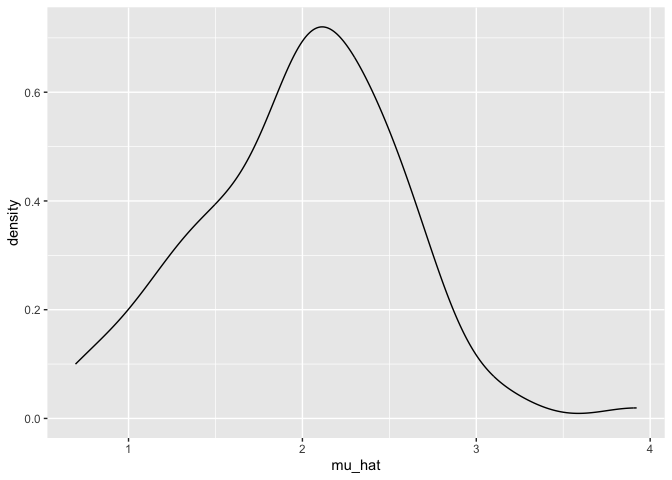
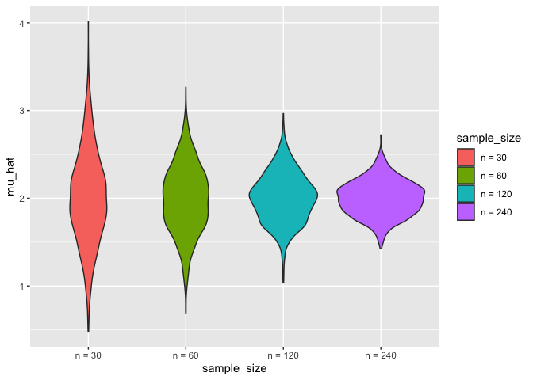
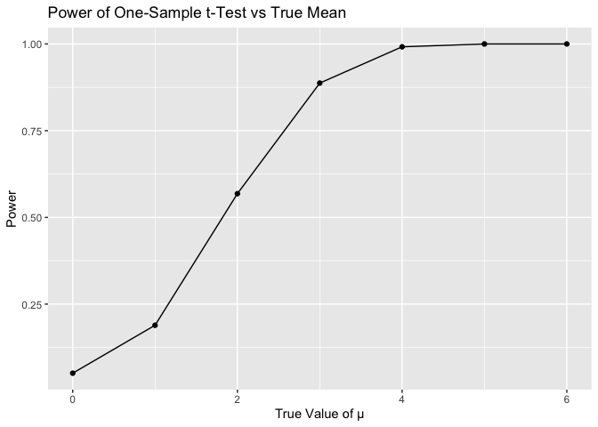
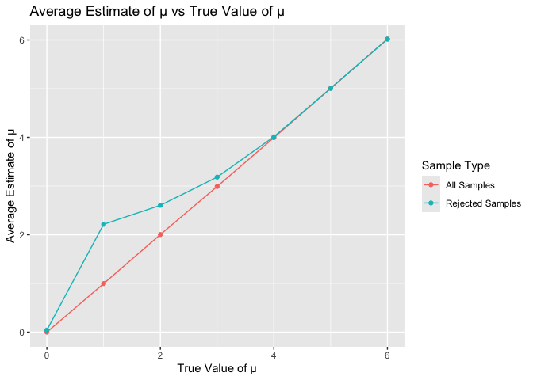
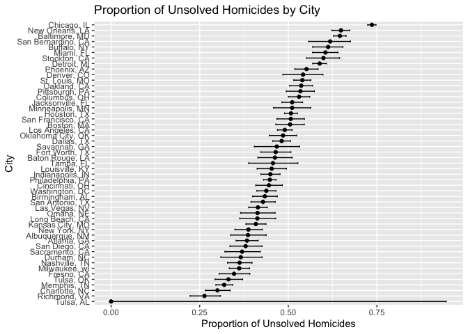

hw\_ 5
================
Mengyao Tang
2024-11-03

# problem 1

``` r
set.seed(1)
sim_mean_sd = function(n, mu = 2, sigma = 3) {
  sim_data = tibble(
    x = rnorm(n, mean = mu, sd = sigma)
  )
  
  sim_data |> 
    summarize(
      mu_hat = mean(x),
      sigma_hat = sd(x)
    )
}

output = vector("list", 100)
for (i in 1:100) {
  output[[i]] = sim_mean_sd(30)
}

sim_results = bind_rows(output)
sim_results |> 
  ggplot(aes(x = mu_hat)) + 
  geom_density()
```

<!-- -->

``` r
sim_results_df = 
  expand_grid(
    sample_size = 30,
    iter = 1:100
  ) |> 
  mutate(
    estimate_df = map(sample_size, sim_mean_sd)
  ) |> 
  unnest(estimate_df)

sim_results_df |> 
  pivot_longer(
    mu_hat:sigma_hat,
    names_to = "parameter", 
    values_to = "estimate"
  ) |> 
  group_by(parameter) |> 
  summarize(
    emp_mean = mean(estimate),
    emp_sd = sd(estimate)
  ) |> 
  knitr::kable(digits = 3)
```

| parameter | emp_mean | emp_sd |
|:----------|---------:|-------:|
| mu_hat    |    1.985 |  0.567 |
| sigma_hat |    2.979 |  0.384 |

``` r
sim_results_df = 
  expand_grid(
    sample_size = c(30, 60, 120, 240),
    iter = 1:1000
  ) |> 
  mutate(
    estimate_df = map(sample_size, sim_mean_sd)
  ) |> 
  unnest(estimate_df)
sim_results_df |> 
  mutate(
    sample_size = str_c("n = ", sample_size),
    sample_size = fct_inorder(sample_size)
  ) |> 
  ggplot(aes(x = sample_size, y = mu_hat, fill = sample_size)) + 
  geom_violin()
```

<!-- -->

``` r
sim_results_df |> 
  pivot_longer(
    mu_hat:sigma_hat,
    names_to = "parameter", 
    values_to = "estimate"
  ) |> 
  group_by(parameter, sample_size) |> 
  summarize(
    emp_mean = mean(estimate),
    emp_var = var(estimate)
  ) |> 
  knitr::kable(digits = 3)
```

    ## `summarise()` has grouped output by 'parameter'. You can override using the
    ## `.groups` argument.

| parameter | sample_size | emp_mean | emp_var |
|:----------|------------:|---------:|--------:|
| mu_hat    |          30 |    2.005 |   0.274 |
| mu_hat    |          60 |    1.989 |   0.148 |
| mu_hat    |         120 |    2.006 |   0.079 |
| mu_hat    |         240 |    1.999 |   0.040 |
| sigma_hat |          30 |    2.976 |   0.151 |
| sigma_hat |          60 |    3.000 |   0.069 |
| sigma_hat |         120 |    2.997 |   0.039 |
| sigma_hat |         240 |    2.992 |   0.021 |

The plot shows that as the group size increases, the probability of the
estimated mean being greater than 2 stabilizes. This suggests that
larger group sizes provide more reliable estimates with less
variability, leading to consistent probabilities. \# Comment The plot
illustrates that as the group size increases, the probability tends to
stabilize, indicating that larger sample sizes result in more consistent
and reliable estimates. This behavior is expected because larger samples
reduce variability and provide better approximations of the true
population parameters.

\#problem2

``` r
set.seed(1)
n <- 30
sigma <- 5
mu_values <- c(0, 1, 2, 3, 4, 5, 6)
num_simulations <- 5000
alpha <- 0.05
sim_results <- map_df(mu_values, function(mu) {
  replicate(num_simulations, {
    sim_data <- rnorm(n, mean = mu, sd = sigma)
    t_test <- t.test(sim_data, mu = 0)
    tidy(t_test) %>% mutate(mu_true = mu, mu_hat = mean(sim_data))
  }, simplify = FALSE) %>% bind_rows()
})
power_results <- sim_results %>%
  group_by(mu_true) %>%
  summarize(power = mean(p.value < alpha))
power_results %>%
  ggplot(aes(x = mu_true, y = power)) +
  geom_line() +
  geom_point() +
  labs(
    title = "Power of One-Sample t-Test vs True Mean",
    x = "True Value of \u03bc",
    y = "Power"
  )
```

<!-- -->

``` r
average_mu <- sim_results %>%
  group_by(mu_true) %>%
  summarize(
    avg_mu_hat = mean(mu_hat),
    avg_mu_hat_rejected = mean(mu_hat[p.value < alpha])
  )
average_mu %>%
  ggplot(aes(x = mu_true)) +
  geom_line(aes(y = avg_mu_hat, color = "All Samples")) +
  geom_line(aes(y = avg_mu_hat_rejected, color = "Rejected Samples")) +
  geom_point(aes(y = avg_mu_hat, color = "All Samples")) +
  geom_point(aes(y = avg_mu_hat_rejected, color = "Rejected Samples")) +
  labs(
    title = "Average Estimate of \u03bc vs True Value of \u03bc",
    x = "True Value of \u03bc",
    y = "Average Estimate of \u03bc",
    color = "Sample Type"
  )
```

<!-- --> 1. The plot of
power as a function of the true value of μ demonstrates a positive
association between effect size and power. As the true value of μ
increases, the power of the one-sample t-test also increases,
approaching 1.0. This indicates that larger effect sizes increase the
likelihood of rejecting the null hypothesis, which is expected since
stronger signals are easier to detect statistically. 2. No, the sample
average of 𝜇̂ across tests for which the null is rejected is not
approximately equal to the true value of 𝜇. The plot shows that for
rejected samples, the average estimate of 𝜇 (blue line) is consistently
higher compared to the average across all samples (red line). This
occurs because when the null hypothesis is rejected, the estimated value
of 𝜇 tends to be biased upwards, due to the selection of larger effect
estimates that are more likely to reach statistical significance. This
phenomenon, known as “selection bias” or “publication bias,” leads to
overestimation when considering only significant results.

\#problem3

``` r
set.seed(1)
homicide_data <- read_csv("/Users/wan/Downloads/homicide-data.csv")
```

    ## Rows: 52179 Columns: 12
    ## ── Column specification ────────────────────────────────────────────────────────
    ## Delimiter: ","
    ## chr (9): uid, victim_last, victim_first, victim_race, victim_age, victim_sex...
    ## dbl (3): reported_date, lat, lon
    ## 
    ## ℹ Use `spec()` to retrieve the full column specification for this data.
    ## ℹ Specify the column types or set `show_col_types = FALSE` to quiet this message.

``` r
homicide_summary <- homicide_data %>%
  mutate(city_state = str_c(city, ", ", state)) %>%
  group_by(city_state) %>%
  summarize(
    total_homicides = n(),
    unsolved_homicides = sum(disposition %in% c("Closed without arrest", "Open/No arrest"))
  )
baltimore_data <- filter(homicide_summary, city_state == "Baltimore, MD")

baltimore_test <- prop.test(baltimore_data$unsolved_homicides, baltimore_data$total_homicides)

baltimore_result <- tidy(baltimore_test) %>%
  select(estimate, conf.low, conf.high)
print(baltimore_result)
```

    ## # A tibble: 1 × 3
    ##   estimate conf.low conf.high
    ##      <dbl>    <dbl>     <dbl>
    ## 1    0.646    0.628     0.663

``` r
city_results <- homicide_summary %>%
  mutate(
    prop_test_result = map2(unsolved_homicides, total_homicides, ~ tidy(prop.test(.x, .y)))
  ) %>%
  unnest(prop_test_result) %>%
  select(city_state, estimate, conf.low, conf.high)
```

    ## Warning: There was 1 warning in `mutate()`.
    ## ℹ In argument: `prop_test_result = map2(...)`.
    ## Caused by warning in `prop.test()`:
    ## ! Chi-squared approximation may be incorrect

``` r
city_results %>%
  ggplot(aes(x = reorder(city_state, estimate), y = estimate)) +
  geom_point() +
  geom_errorbar(aes(ymin = conf.low, ymax = conf.high), width = 0.3) +
  coord_flip() +
  labs(
    title = "Proportion of Unsolved Homicides by City",
    x = "City",
    y = "Proportion of Unsolved Homicides"
  )
```

<!-- --> The raw data consists of
homicide records in major U.S. cities. Each record includes information
about the location of the homicide (city and state), and the current
status of the case (disposition), among other details. The plot shows
the proportion of unsolved homicides across various cities in the United
States. Each city is listed on the y-axis, while the x-axis represents
the proportion of homicides that remain unsolved. The black dots
indicate the estimated proportion for each city, while the horizontal
lines represent the confidence intervals around those estimates.

From the plot, we can see a substantial variation between cities in
terms of the proportion of unsolved homicides. Some cities have a very
high proportion of unsolved cases, with confidence intervals that do not
overlap much with those of other cities, indicating potential
differences in investigation efficiency or local crime conditions.
